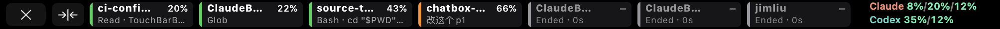
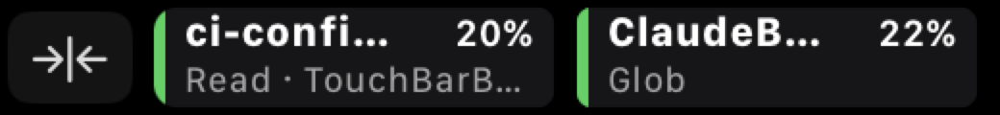
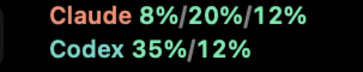

# TouchQuota

[](https://github.com/siyanliu1/TouchQuota/actions/workflows/tests.yml)
[](https://developer.apple.com)
[](#requirements)
[](https://github.com/tddworks/ClaudeBar)

TouchQuota puts your Claude Code sessions and your Claude / Codex quotas **on the MacBook Pro Touch Bar**.

Every Claude Code session you have open becomes a tile on the strip: which repo it is in, how full its context window is, what it is doing right now, and, loudest of all, when it is waiting on you. Next to the tiles sit your Claude and Codex quota numbers. Nothing to open, nothing to switch to; it is just there under your fingers while you type.

<p align="center">
  
</p>

TouchQuota is a fork of [ClaudeBar](https://github.com/tddworks/ClaudeBar). Everything ClaudeBar does (the menu bar item, the popover, themes, notifications, the notch live activity, a dozen AI providers) is still here and works the same. See the [ClaudeBar README](https://github.com/tddworks/ClaudeBar#readme) for that half of the app. This page is about the Touch Bar.

## What you see

All screenshots are the real Touch Bar with real sessions and live quota data.

### Closed: a small item in the Control Strip

<p align="center">
  
</p>

When the board is closed, TouchQuota is a small button next to the media keys. The dot takes the colour of your most urgent session (amber means one of them needs you), and the number is the same quota your menu bar item shows. Tap it to open the board.

### Compact: the board next to the Control Strip

<p align="center">
  
</p>

The default. The board sits in the app area of the bar and leaves the Control Strip (brightness, volume, Siri, and the TouchQuota item itself) where it is. Four tiles fit; swipe to reach the rest. The `✕` on the left closes it.

### Wide: the whole bar

<p align="center">
  
</p>

Tap `→|←` and the board takes the full width: seven tiles at once, with the Control Strip hidden. Tap `→|←` again to go back, or `✕` to close. Whichever layout you leave it in is the one you get next time.

When no Claude Code session is running, the board says so instead of showing tiles.

## Reading the board

### A session tile

<p align="center">
  
</p>

One tile per Claude Code session:

| Part | Meaning |
|---|---|
| **Colour bar** on the left | What the session is doing. Green: working. Blue: subagents working. Yellow: needs you. Orange: finished its turn, waiting for your next prompt. Grey: session ended. |
| **Name** | The repository the session is running in. |
| **Percentage** | How full the session's context window is. Turns amber at 80 % and red at 90 %. |
| **Second line** | What matters most right now: the permission it is waiting on, the tool it is running, your last prompt, or its last reply. |

A session that **needs you** (a permission prompt, a question, a dialog) gets an amber fill and a `Needs you · …` line, and always jumps to the front. Sessions that have ended stay on the board for ten minutes, dimmed, so you can see what just finished.

### The quota column

<p align="center">
  
</p>

- **Claude**: session (5 h) / weekly (7 d) / Fable
- **Codex**: session (5 h) / weekly (7 d)

The numbers follow your *Remaining* / *Used* choice in Settings → Menu Bar, just like the menu bar item. Either way each number is coloured by how much is left: green above 50 %, yellow between 20 % and 50 %, red below 20 %. A `–` means the provider did not report that window. **Tap the column to refresh** both providers.

## Getting started

1. **Install TouchQuota.** See [Installation](#installation).
2. **Turn on hooks.** Settings → Hooks → *Claude Code Hooks*. This is how TouchQuota learns about your sessions. Your existing Claude Code settings are left intact, and turning hooks off puts everything back.
3. **Turn on the board.** Settings → General → *Touch Bar Board*. The item appears in the Control Strip right away.
4. Optionally choose **Board Width** (Compact or Wide) in the same place. The `→|←` button on the bar changes the same setting.

Start a Claude Code session in any terminal and its tile appears. You do not need to restart anything.

## Requirements

- A MacBook Pro **with a Touch Bar**. macOS 26 still supports four of them: 16-inch 2019, 13-inch 2020 (four ports), 13-inch M1, 13-inch M2. TouchQuota runs fine on any other Mac; you just get the menu bar app.
- macOS 15 or later.
- [Claude Code](https://claude.ai/code) for sessions and Claude quota, [Codex CLI](https://github.com/openai/codex) for Codex quota. Both optional; a missing provider shows as dashes.

## Installation

There are no packaged downloads yet. Build it from source:

```bash
git clone https://github.com/siyanliu1/TouchQuota.git
cd TouchQuota
brew install tuist
tuist install
tuist generate
open TouchQuota.xcworkspace
```

Then press `Cmd+R` in Xcode. The app appears in your menu bar.

## Good to know

- Only Claude Code sessions appear as tiles. Codex contributes quota numbers, not sessions.
- The Mac App Store build of the app has no Touch Bar support.
- TouchQuota installs alongside ClaudeBar without conflict: it has its own name, its own settings (`~/.touchquota/`) and its own update feed.

## Credits

TouchQuota is a fork of [tddworks/ClaudeBar](https://github.com/tddworks/ClaudeBar) by [@hanrw](https://github.com/hanrw) and its [contributors](https://github.com/tddworks/ClaudeBar#contributors). Everything outside the Touch Bar is their work. Bugs in those areas are best reported upstream; anything about the Touch Bar belongs [here](https://github.com/siyanliu1/TouchQuota/issues).

## License

MIT
